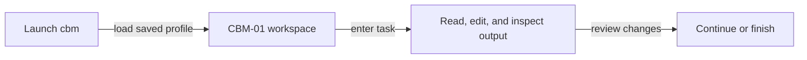

# CBM-01 rebrand and terminal redesign

Status: identity requirements confirmed; visual direction is open. Captured 2026-09-10 against `modded` at `426480b8c`.

## Problem Statement

The fork still shows its upstream identity in banners, terminal titles, help, warnings, conversation exports, and launcher output. The user wants the product called **CBM-01** and wants to explore a cyberpunk aesthetic without losing the existing standalone coding workflow.

## Solution

Use CBM-01 consistently for the fork's product-owned display copy. Offer three local HTML concepts before selecting the terminal design. Keep a saved implementation queue and extend the existing upstream merge strategy so a later sync does not restore the old brand or break provider support.

Confirmed request: [conversation record](design/cbm-01-request.md). Strategic context: [PRODUCT.md](../PRODUCT.md). Interactive sketches: [design options](design/cbm-01-options.html).

## User Stories

1. As a developer, I want the app to introduce itself as CBM-01 so I know which fork I am running.
2. As a developer, I want the same identity in the terminal title, header, narrow logo, help, notifications, and errors.
3. As a developer using a short or narrow terminal, I want a readable text fallback instead of cropped banner art.
4. As a developer, I want to compare cyberpunk directions before committing to a visual style.
5. As a developer, I want representative home, session, and provider screens in that comparison.
6. As a keyboard user, I want the draft controls and shipped CLI controls to remain accessible.
7. As an existing user, I want `cbm`, my profiles, bindings, chosen model, and OAuth credentials to keep working.
8. As an existing user, I want light mode, terminal color fallbacks, and animation preferences to survive a redesign.
9. As a developer, I want exported conversations and product-generated callback pages to use the new identity.
10. As a maintainer, I want updates to keep finding the existing published binaries.
11. As a maintainer, I want fork changes grouped into reviewable commits and a clear rollback path.
12. As a maintainer, I want a repeatable check that catches old display branding after an upstream merge.
13. As a maintainer, I want original attribution retained accurately.
14. As a returning agent, I want a baton pointing to the next unblocked ticket and any unresolved design choice.

## Happy path

This is the intended identity change around an existing working flow, not a new provider or agent architecture. [.context/happy-path.md](../.context/happy-path.md) points here.

## Implementation Decisions

- The exact display identity is **CBM-01**. The original letter-O spelling is superseded.
- Use one small shared display-brand constant at the existing CLI constants seam where practical. Keep explicit component text easy to inspect; do not introduce a brand service or runtime string-replacement filter.
- The shipped fork's visible copy is in scope, including responsive logos, titles, startup/help, warnings, exports, clipboard summaries, callback HTML, updater/postinstall messages, and agent self-identification. Inspect callers before editing a shared seam.
- Product-owned display copy must not use the old brand as the app's identity. **Compatibility exception:** real package/import names, executable/download names, environment keys, paths, protocol identifiers, original licenses/notices, and truthful diagnostics about those identifiers remain accurate. This is an implementation boundary chosen to preserve existing behavior, not a claim that the user approved every residual string.
- Preserve `cbm`, the existing package and binary distribution, provider routing, credential locations, active selection, model discovery, OAuth behavior, and all backend bypass conditions. No storage migration, public API change, or provider configuration change belongs in this work.
- The HTML options are static sample screens with native browser radio controls. They perform no coding tasks, profile changes, or authentication.
- The visual candidates are **A: Neon Circuit**, **B: Amber Grid**, and **C: Ghostline**. A is an agent recommendation, not a selected design. The user has not selected a palette or layout.
- Identity cleanup is independent of palette selection. The theme ticket begins after a direction is confirmed. The concepts explore rails and density; implementation must fit existing terminal layout primitives and retain responsive behavior rather than promise every browser effect.
- Use existing theme and logo seams. Keep automatic/light themes, terminal capability detection, user overrides, and motion preferences. No decorative animation is necessary.
- Keep local planning files as the current queue. GitHub is authenticated, but publishing the prepared issues and any release remains a separate external step. This is the reversible planning default for the requested draft.

## Testing Decisions

- Check behavior: rendered product name, help output, title escapes, responsive logo selection, and exported display strings. Reuse current Bun tests and terminal renderer helpers.
- Add one focused branding regression check, including narrow/short terminals, plus existing relevant tests. A global text count is not evidence of successful rebranding because imports and notices legitimately retain old identifiers.
- Run the affected package typechecks. If shared SDK/agent files change, run their relevant regressions too.
- Run existing provider/auth preservation tests without signing in or changing live profile files.
- Inspect every HTML direction and screen at desktop and narrow widths; verify keyboard selection and absence of horizontal page overflow.
- Build the Windows binary for runtime-graph verification and inspect `--help`/`--version`. Interactive CLI acceptance uses the project's tmux convention when available; if unavailable, state the limit and retain renderer tests/build smoke evidence.
- Broad Windows suites have known failures recorded in `.context/active-work.md` at the starting revision. A targeted failure is not waived by those counts: reproduce it at the baseline before classifying it as pre-existing.

## Out of Scope

Renaming the GitHub repository/npm package, modifying original notices, changing authentication or provider selection, adding an unrelated web app, purchasing assets, publishing releases, and claiming literal zero source occurrences of old technical names. A later full distribution migration needs its own compatibility and rollout plan.

## Further Notes

Planning used two independent GPT-6 Astra agents under the installed Traycer selection guide. The Partner supplied eight file warrants, verified mechanically; Pressure accepted the compatibility boundary after rejecting literal-zero claims. This was **same-model scrutiny**, not cross-model validation. No visual bar was confirmed, so gauntlet is not chained.

The same-model agents' verdict does not approve a visual direction on the user's behalf.

## Work queue

1. [01: Rebrand the complete visible CLI path](issues/01-cbm-01-identity.md), ready.
2. [02: Apply the selected cyberpunk direction](issues/02-cbm-01-theme.md), waits for direction and 01.
3. [03: Verify integration and preserve the fork through merges](issues/03-cbm-01-integration.md), waits for 01 and 02.

Execution and merge rules: [workflow](design/cbm-01-workflow.md). Upstream sync and release authority: [MERGE-STRATEGY.md](../MERGE-STRATEGY.md).
